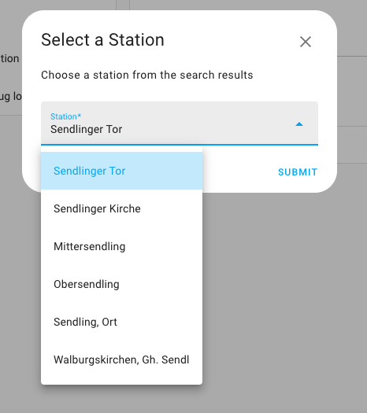
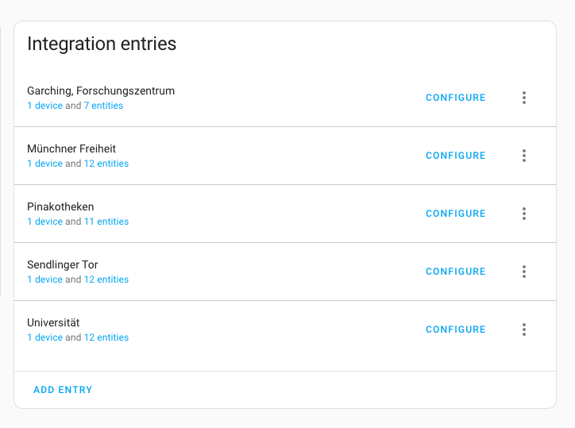
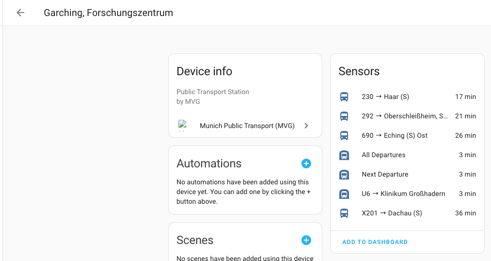
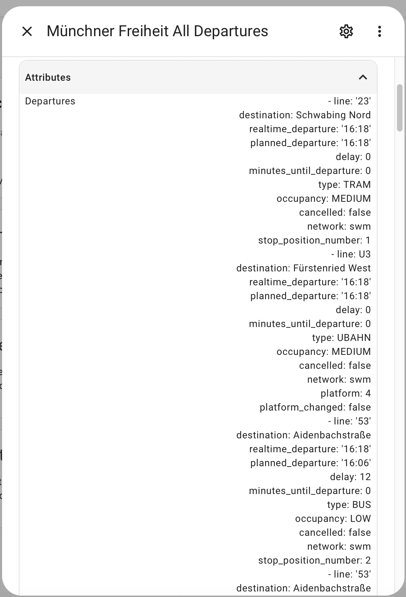
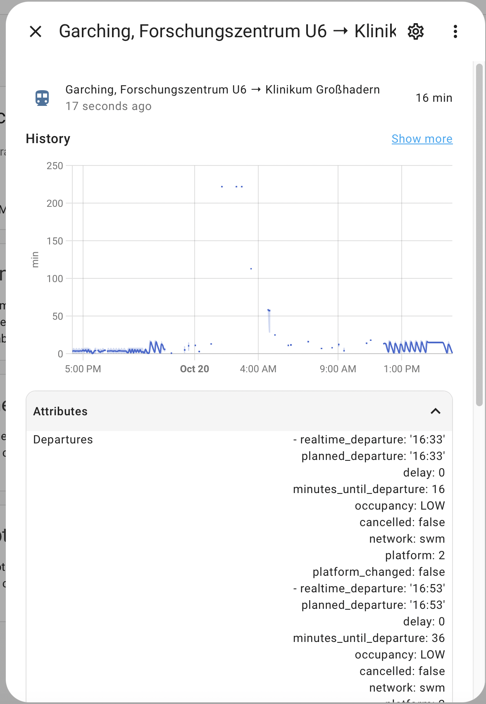
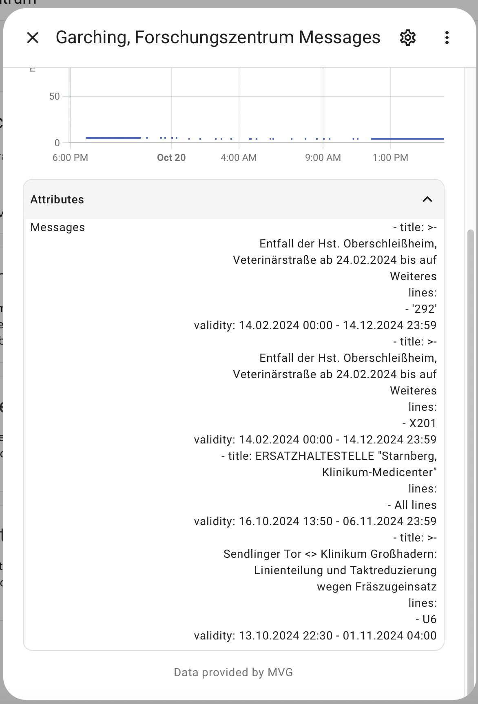

# Munich Public Transport (MVG) Integration for Home Assistant

Home Assistant custom integration for Munich public transport departures.

This integration is not affiliated with, endorsed by, or sponsored by MVG, MVV,
or Stadtwerke München.

## Overview

Munich Public Transport lets Home Assistant monitor upcoming departures for
selected Munich public transport stations. Each configured station becomes one
Home Assistant device with sensors for the next departure, all selected
departures, and each selected line/direction pairing.

The current integration is a rewrite built on the standalone
[`munich-transport`](https://github.com/g4bri3lDev/munich-transport) Python
package. It uses one shared departure coordinator per station so all sensors for
one station are updated from the same API response.

## Features

- UI-based setup and options flow.
- Station search with support for stations that share the same name.
- Multiple configured stations.
- Line and direction selection grouped by transport type.
- Stable line/direction entities based on MVG schedule catalogs.
- Temporary termini support when MVG publishes construction schedules.
- Night bus, bus, tram, U-Bahn, S-Bahn, regional bus, and replacement service
  schedule groups when available for a station.
- One shared live departures request per station refresh.
- One shared MVG service messages request for all configured stations.
- Retry handling for temporary MVG API errors such as `429`, `502`, `503`, and
  `504`.
- Legacy config-entry migration from the old integration schema.

## Installation

Requires Home Assistant `2024.7.0` or newer.

### HACS

### Manual Installation

1. Download the latest release from
   [GitHub releases](https://github.com/g4bri3lDev/munich_public_transport/releases).
2. Copy `custom_components/munich_public_transport` into the
   `custom_components` directory of your Home Assistant configuration.
3. Restart Home Assistant.

## Configuration

1. In Home Assistant, go to **Settings** > **Devices & services**.
2. Click **Add integration**.
3. Search for **Munich Public Transport**.
4. Enter a station search term.
5. Select the station from the search results.
6. Select the line and direction pairings to expose as sensors.

The options flow can be used later to change the selected line/direction
pairings for a station.

## Entities

Each configured station creates:

- **Next Departure**: minutes until the next selected departure.
- **All Departures**: minutes until the next selected departure, with upcoming
  departures in the `departures` attribute.
- **Messages**: number of relevant MVG service messages.
- **Line/direction sensors**: one sensor for each selected pairing.

Line/direction sensors use the normal catalog terminus for stable entity IDs,
while the visible entity name follows the current live terminus. For example, a
U-Bahn direction may keep a stable entity ID for `Fürstenried West` while the
display name temporarily shows `Sendlinger Tor` during construction.

## Attributes

Departure attributes use the legacy names where practical so existing
automations keep working:

- `line`
- `destination`
- `realtime_departure`
- `planned_departure`
- `delay`
- `minutes_until_departure`
- `type`
- `occupancy`
- `cancelled`
- `network`
- `platform`
- `platform_changed`
- `realtime`
- `direction_key`

Line/direction sensors also expose selection metadata:

- `normal_terminus`
- `direction_variants`
- `schedule_kind`
- `departures`

The **Messages** sensor exposes a `messages` attribute. Each message includes:

- `title`
- `description`
- `lines`
- `type`
- `validity`

## Screenshots

### Selecting a station from the search results

### All added stations

### Device overview

### All departures

### A specific line and direction

### Messages for a station

## Troubleshooting

- If setup cannot find a station, try a shorter or more specific station name.
- If a station has no selectable line/direction entries, MVG may not publish a
  schedule catalog for that station or product group.
- Temporary MVG API failures are handled by the station coordinator. During an
  outage, entities may become temporarily unavailable instead of logging one
  error per sensor.
- MVG service messages are fetched by one shared coordinator and then filtered
  per station by affected station or selected lines.
- If a migrated station does not select the expected directions, open the
  integration options and reselect the line/direction pairings.

## License

This project is licensed under the Apache License 2.0. See [LICENSE](LICENSE)
for details.
