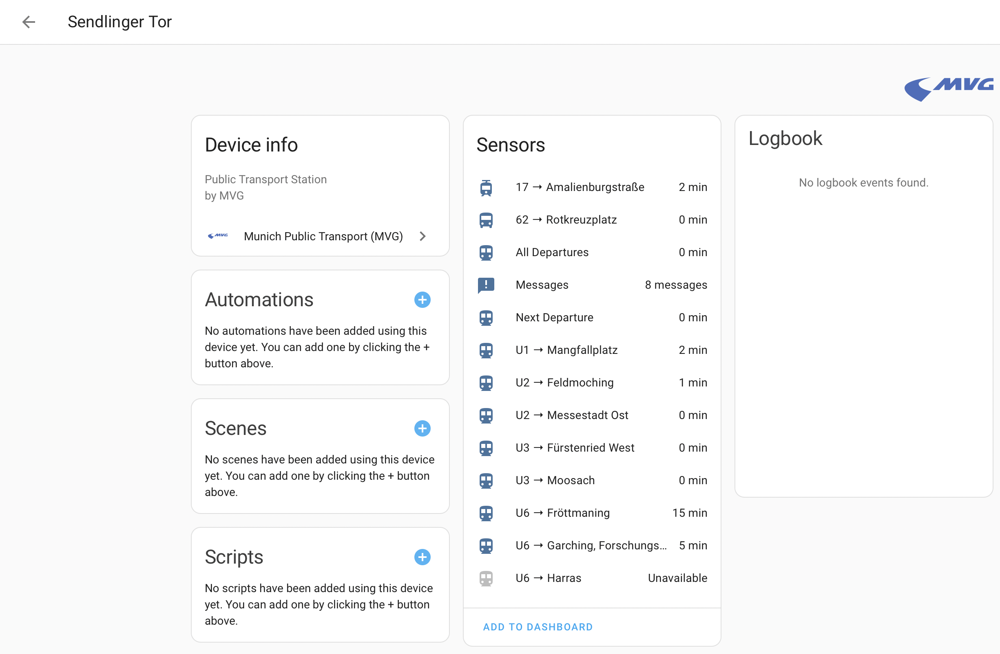

# Munich Public Transport (MVG) Integration for Home Assistant

## Overview

This custom integration allows you to monitor public transport departures in Munich, Germany, directly from your Home Assistant instance. It provides real-time information about upcoming departures for selected stations, lines, and directions.

## Features

- Departure information for Munich public transport
- Configurable through the Home Assistant UI
- Support for multiple stations
- Filtering by specific lines and directions
- Customizable update interval
- Sensors for next departure and all upcoming departures
- Individual sensors for each selected line and direction

## Installation

### HACS (Home Assistant Community Store)

This integration is not yet available in the default HACS repositories. To install it using HACS, follow these steps:

1. Ensure you have [HACS](https://hacs.xyz/) installed in your Home Assistant instance.
2. In the HACS panel, click on "Integrations".
3. Click the three dots in the top right corner and select "Custom repositories".
4. Add the following information:
   - Repository: `https://github.com/g4bri3lDev/munich_public_transport`
   - Category: Integration
5. Click "Add".
6. Search for "Munich Public Transport" in the HACS store.
7. Click "Install" and follow the prompts.
8. Restart Home Assistant.

### Manual Installation

1. Download the latest release from the GitHub repository.
2. Unzip the download and copy the `munich_public_transport` folder to your `custom_components` directory in your Home Assistant configuration directory.
3. Restart Home Assistant.

## Configuration

1. In Home Assistant, go to Configuration > Integrations.
2. Click the "+" button to add a new integration.
3. Search for "Munich Public Transport" and select it.
4. Follow the configuration steps:
    - Enter a search query for the station you want to monitor.
    - Select the specific station from the search results.
    - Choose the lines you want to track (optional).
    - Select the directions you want to monitor (optional).
    - Set the number of departures to display for each line/direction.
    - Configure the update interval.

## Sensors

The integration creates the following sensors:

- `sensor.next_departure`: Shows the time until the next departure across all selected lines and directions.
- `sensor.all_departures`: Provides a list of all upcoming departures across all selected lines and directions.
- Individual sensors for each selected line and direction combination (e.g., `sensor.u3_to_moosach`).

## Customization

You can customize the integration's behavior through the Options flow:

1. Go to Configuration > Integrations.
2. Find the Munich Public Transport integration and click "Options".
3. Adjust the lines, directions, number of departures, and update interval as needed.

## Screenshots
### Selecting a station from the search results

### All added stations

### Device Overview

### All Departures

### A specific line and direction

## Troubleshooting

- If you encounter connection errors, ensure that your Home Assistant instance has internet access.
- Check that the MVG API is operational and not experiencing downtime.
- For persistent issues, check the Home Assistant logs for more detailed error messages.

## Contributing

Contributions to this project are welcome! Please fork the repository and submit a pull request with your improvements.

## License

This project is licensed under the MIT License. See the LICENSE file for details.

## Acknowledgements

- This integration uses the [MVG API](https://github.com/jrester/mvg) by jrester.
- Thanks to the Home Assistant community for their support and feedback.

## Disclaimer

This integration is not officially affiliated with or endorsed by MVG (Münchner Verkehrsgesellschaft). Use at your own risk.